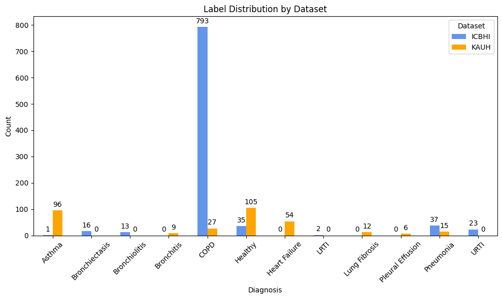
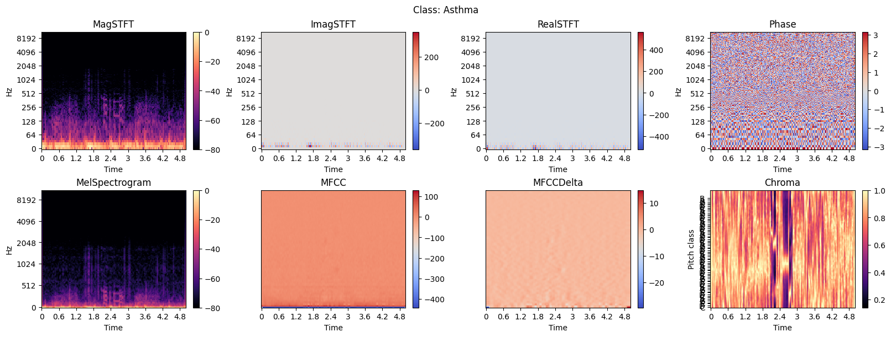
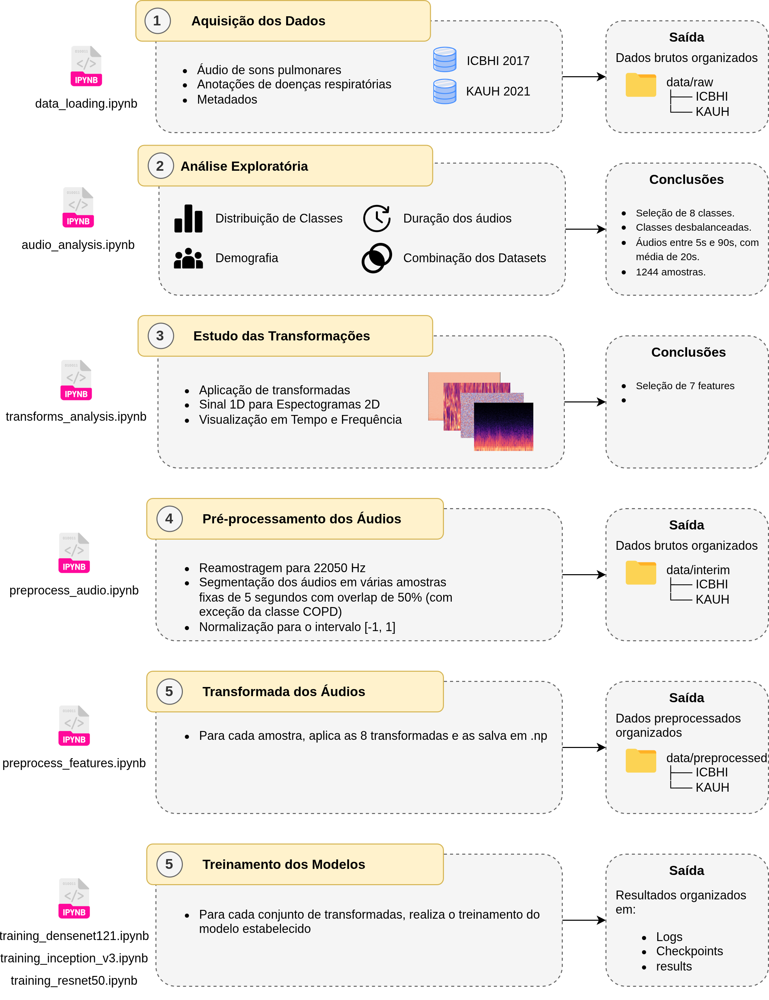
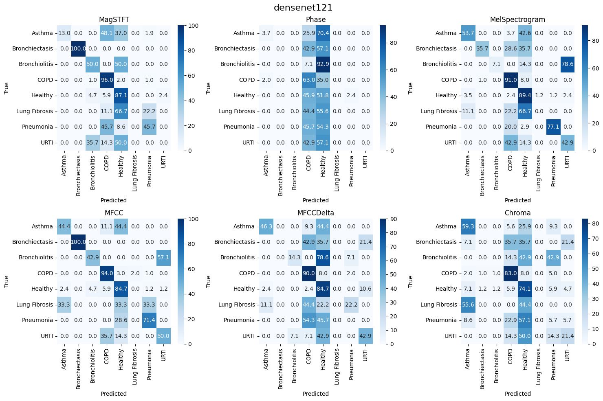
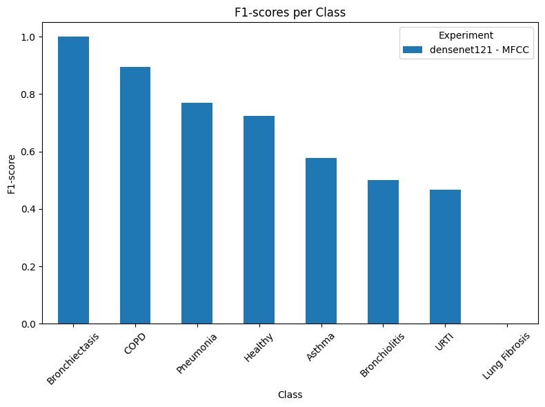

# `Classificação de Sons Pulmonares a partir de Espectrogramas`
# `Classification of Lung Sounds using Spectrograms`

## Apresentação

O presente projeto foi originado no contexto das atividades da disciplina de pós-graduação *IA901 - Análise de Imagens e Reconhecimento de Padrões*, oferecida no primeiro semestre de 2026, na Unicamp, sob supervisão da Profa. Dra. Leticia Rittner, do Departamento de Engenharia de Computação e Automação (DCA) da Faculdade de Engenharia Elétrica e de Computação (FEEC).

| Nome                    | RA     | Curso                                 |
|-------------------------|--------|---------------------------------------|
| Rafael Ávila dos Santos | 300905 | Doutorado em Engenharia Elétrica |
| Letícia Lopes Mendes Da Silva | 184423 | Graduação em Engenharia de Computação |
| Sofia Ballerini de Vasconcellos | 299904 | Doutorado em Engenharia Elétrica |

## Descrição do Projeto

As doenças respiratórias estão entre as principais causas de morbidade e mortalidade no mundo. Segundo a World Health Organization, enfermidades como pneumonia, doença pulmonar obstrutiva crônica (DPOC) e asma afetam milhões de pessoas anualmente, impactando diretamente o sistema de saúde. O diagnóstico precoce dessas condições é fundamental para melhorar o prognóstico dos pacientes e reduzir complicações.

Um dos métodos mais utilizados na avaliação do sistema respiratório é a ausculta pulmonar. Durante o exame, o profissional de saúde analisa os sons produzidos pela passagem de ar pelas vias respiratórias, buscando identificar padrões anormais, como sibilos (wheezes), estalos (crackles) e outros ruídos adventícios associados a diferentes patologias. No entanto, a interpretação dos sons pulmonares depende da experiência do examinador e pode variar entre profissionais. Com isso, técnicas de inteligência artificial têm sido exploradas como ferramentas de apoio ao diagnóstico, permitindo a análise automática de sons respiratórios.

Nesse contexto, o objetivo deste projeto é desenvolver modelos para a classificação de diferentes doenças respiratórias a partir de gravações de ausculta pulmonar. Para isso, exploramos a transformação dos sinais de áudio em representações tempo-frequência, utilizando transformadas como a Short-Time Fourier Transform (STFT), o Mel Spectrogram e os Mel-Frequency Cepstral Coefficients (MFCCs). Essas representações permitem capturar simultaneamente características temporais e espectrais dos sons respiratórios. A partir desse processamento, procuramos entender se tais transformações são capazes de preservar as características relevantes e anomalias dos sons pulmonares, ao ponto de auxiliarem na identificação de patologias.

## Bases de Dados

Os datasets públicos utilizados no projeto consistem em gravações de sons respiratórios obtidas em contexto clínico, acompanhadas de anotações e metadados associados. As bases foram escolhidas devido ao amplo uso em pesquisas de classificação automática de doenças pulmonares. As informações apresentadas a seguir foram obtidas a partir da análise exploratória realizada em `audio_analysis.ipynb`.

Os áudios de ambas as bases estão disponíveis no formato `.wav`, e foram adquiridos utilizando diferentes estetoscópios digitais.

### [ICBHI 2017](https://bhichallenge.med.auth.gr/ICBHI_2017_Challenge)

A base ICBHI 2017 é composta por **920 gravações respiratórias**, provenientes de **126 pacientes**, anotadas em **8 classes diagnósticas**. As anotações estão em arquivos de texto (`.txt`), sendo um deles responsável por relacionar o identificador de cada paciente ao respectivo diagnóstico (`ICBHI_Challenge_diagnosis.txt`), e outro contendo informações demográficas (`ICBHI_Challenge_demographic_information.txt`).

### [KAUH (2021)](https://data.mendeley.com/datasets/jwyy9np4gv/3)

A base KAUH (2021) é composta por **336 gravações respiratórias** de **112 pacientes**, anotadas em **8 classes diagnósticas**, podendo haver co-ocorrência de classes. Durante a nossa análise exploratória, removemos amostras multilabel, resultando em **324 gravações respiratórias** de **108 pacientes**. As anotações estão no fomato de planilha Excel (`Data annotation.xlsx`), contendo dados do paciente, informações sobre a aquisição do exame (modo de filtragem do estetoscópio, por exemplo) e o diagnóstico associado.

### Base Combinada

Ao combinar as duas bases (1.244 amostras no total), verificamos que o desbalanceamento entre classes é o principal desafio do projeto: a classe COPD concentra 820 amostras (≈ 66% do total combinado), enquanto classes como Bronchitis, Bronchiolitis, Lung Fibrosis, Pleural Effusion e LRTI somam poucas dezenas de amostras no total.

| Característica | ICBHI 2017 | KAUH (2021) |
| -------------- | ---------: | ----------: |
| Total de gravações    | 920 | 324 |
| Número de pacientes   | 126 | 108 |
| Classes diagnósticas  |   8 |   8 |
| Classes consideradas  | COPD, Pneumonia, Healthy, URTI, Bronchiectasis, Bronchiolitis, LRTI, Asthma | Healthy, Asthma, Heart Failure, COPD, Pneumonia, Lung Fibrosis, Bronchitis, Pleural Effusion |
| Classe majoritária    | COPD — 793 amostras (≈ 86% do ICBHI) | Healthy — 105 amostras (≈ 32% do KAUH) |
| Classe minoritária    | Asthma — 1 amostra | Pleural Effusion — 6 amostras |
| Taxa de amostragem    | Variável conforme o equipamento de aquisição | 4.000 Hz |
| Duração mínima        |   7,86 s | 5,00 s  |
| Duração máxima        |  86,20 s | 30,00 s |
| Duração média         |  21,49 s | 17,18 s |
| Tipo de anotação      | Diagnóstico por paciente, dados demográficos (idade, sexo, IMC/peso/altura) e marcação manual de ciclos respiratórios, sibilos e estalos por especialistas | Planilha contendo dados do paciente, modo de filtragem acústica do estetoscópio, ponto de auscultação e diagnóstico associado |

---



Para mais informações, consulte o Datasheet: [Datasheet (PDF)](data/datasheet.pdf)


## Metodologia

### Pré-processamento do Sinal de Áudio (1D)

Conforme identificado na análise exploratória, as gravações originais do dataset ICBHI apresentam durações bastante heterogêneas (entre 7,86s e 86,20s, com média de 21,49s), além de forte desbalanceamento entre classes. A primeira abordagem testada para padronizar as durações consistiu em preencher os áudios mais curtos com zeros e truncar os mais longos, fixando todas as amostras em 20 segundos. Essa estratégia, entretanto, introduz um problema: para os áudios mais curtos, é criada uma região "vazia" no espectrograma resultante, que não carrega informação sobre a patologia.

Para contornar essa limitação, o pipeline atual substitui o zero-padding por uma estratégia de segmentação, ou janelamento, dos áudios com sobreposição. Assim, foram realizados os seguinte pré-processamentos:

- **Reamostragem**: todos os sinais são reamostrados para uma taxa de amostragem comum de 22.050 Hz.
- **Segmentação**: cada gravação é dividida em janelas de 5 segundos. Para a maioria das classes, utiliza-se um *hop* de 2,5 segundos (50% de sobreposição), o que também funciona como uma forma de data augmentation, aumentando a quantidade de amostras disponíveis para as classes minoritárias. Para a classe COPD, utiliza-se um *hop* de 5 segundos (ou seja, sem sobreposição), estratégia que serve como um *undersampling* desta classe para tentar mitigar o desbalanceamento.
- **Normalização**: cada janela de áudio é normalizada para o intervalo [-1, 1].

Essa abordagem atua simultaneamente como mecanismo de data augmentation (para classes minoritárias) e de subamostragem (para a classe COPD). O notebook `preprocess_audio.ipynb` contém este pipeline de transformações.

### Extração de Características Tempo-Frequência (2D)

A partir do sinal 1D pré-processado, diferentes representações tempo-frequência são extraídas utilizando a biblioteca `Librosa`. Todas partem da Short-Time Fourier Transform (STFT), que divide o sinal em janelas curtas e calcula a Transformada de Fourier em cada uma:

$$X(m,k)=\sum_{n=0}^{N-1} x[n+mH]\,w[n]\,e^{-j2\pi kn/N}$$

Sendo:

- x[n]: sinal de áudio
- w[n]: janela (geralmente Hann)
- N: tamanho da FFT
- H: hop length
- m: índice temporal
- k: bin de frequência

A partir do coeficiente complexo $X(m,k)$, são derivadas oito representações, as quais podem ser melhor visualizadas no notebook de exploração das transformadas `transform_analysis.ipynb`.

**Parte Real e Parte Imaginária da STFT (RealSTFT / ImagSTFT)**

$$\text{RealSTFT}(m,k) = \Re(X(m,k)) \qquad \text{ImagSTFT}(m,k) = \Im(X(m,k))$$

**Magnitude do Espectro (MagSTFT)**

A magnitude representa a energia/amplitude de cada frequência ao longo do tempo:

$$|X(m, k)| = \sqrt{\Re(X)^2 + \Im(X)^2}$$

**Fase Espectral (Phase)**

$$\phi(m, k) = \tan^{-1}\left(\frac{\Im(X(m, k))}{\Re(X(m, k))}\right)$$

**Mel Spectrogram**

Calculada em duas etapas. Primeiro o espectrograma de potência:

$$P(m, k) = |X(m, k)|^2$$

Depois aplica-se um banco de filtros Mel:

$$M(m,r)= \sum_k{H_r(k)P(m,k)}$$

Onde $H_r(k)$ é o filtro triangular Mel e r é o índice do filtro. Essa transformação comprime altas frequências para imitar a audição humana.

**Mel Frequency Cepstral Coefficients (MFCC)**

Aplica-se a Discrete Cosine Transform (DCT) sobre o log-Mel spectrogram:

$$L(m, r) = \log(M(m, r))$$

$$C(m, n) = \sum_k^R{}L(m, r)\cos\left[\frac{\pi n}{R} \left(r + \frac{1}{2}\right)\right]$$

Onde $C(m,n)$ é o coeficiente MFCC e R o número de filtros Mel.

**Delta MFCC (MFCCDelta)**

Derivada temporal dos coeficientes MFCC:

$$\Delta c_t= \frac{\sum_{n=1}^{N} n(c_{t+n}-c_{t-n})}{2\sum_{n=1}^{N} n^2}$$

**Chroma**

$$Chroma(p, t) = \sum_{k \in K_{p}}{|X(t, k)|}$$

Onde p é a classe cromática (C, C#, D, ...) e $K_p$ são os bins associados àquela nota.

O notebook `preprocess_features.ipynb` contém este pipeline de extração de features para o treinamento.

Abaixo, estão alguns exemplos de diferentes transformadas mostradas para uma amostra da classe Asthma.



**Combinações de canais (stacks)**

Além das oito representações individuais, também foram testadas combinações de 2 a 3 representações empilhadas em um único tensor multicanal, de forma análoga aos canais RGB de uma imagem natural. Os experimentos incluem as combinações:

- ImagSTFT + RealSTFT (2 canais)

- MagSTFT + Phase (2 canais)

- MelSpectrogram + MFCC + Chroma (3 canais)

Após a extração, todas as 8 representações individuais são salvas em arquivos `.npz`, formato binário do NumPy que permite armazenar múltiplos arrays de forma compacta, preservando a estrutura numérica das features e evitando custos adicionais durante o treinamento dos modelos.

### Modelos de Classificação e Treinamento

A classificação é realizada utilizando três arquiteturas de CNN muito utilizadas na literatura para classificação de imagens:  **InceptionV3**, **ResNet50** e **DenseNet121**. O pipeline de treinamento foi implementado em PyTorch, com PyTorch Lightning estruturando o laço de treinamento.

Para cada arquitetura, o mesmo protocolo experimental é repetido para cada configurações de features. Na primeira etapa, são avaliadas 6 features individuais:

- MagSTFT
- MelSpectrogram
- MFCC
- MFCCDelta
- Chroma
- Phase

Depois, são avaliadas 3 combinações de canais:

- ImagSTFT + RealSTFT
- MagSTFT + Phase
- MelSpectrogram + MFCC + Chroma

RealSTFT e ImagSTFT, em particular, não são utilizadas isoladamente, apenas como parte da combinação de 2 canais. Isso totaliza 9 treinamentos por arquitetura. Ao todo são realizados 10 treinamentos por arquitetura, pois a combinação MelSpectrogram + MFCC + Chroma é treinada duas vezes: uma vez do zero e outra reaproveitando os pesos pré-treinados no ImageNet, permitindo comparar o efeito do pré-treino especificamente para essa combinação. Os principais hiperparâmetros utilizados são:

| Hiperparâmetro | Valor |
|---|---|
| Arquiteturas testadas | ResNet50, InceptionV3, DenseNet121 |
| Otimizador | AdamW |
| Taxa de aprendizado | 1e-4 |
| Weight decay | 1e-5 |
| Scheduler | StepLR (step_size=7, gamma=0.1) |
| Função de perda | CrossEntropyLoss |
| Batch size | 32 |
| Precisão de treinamento | Mixed precision (16-bit) |
| Épocas máximas | 100, com early stopping e paciência de 10 épocas, monitorando `val_f1_macro` |
| Checkpoint do modelo | Melhor checkpoint salvo conforme `val_f1_macro` |
| Estratégia de balanceamento de classes | Sampler "equalizer" é utilizado no DataLoader para balanceamento entre classes durante o treinamento. Além disso, é estabelecido um limite de 1000 amostras por classe, reduzindo, assim, o número de amostras COPD |
| Divisão dos dados | Holdout em treino/validação/teste, particionado por paciente para evitar que o mesmo paciente aparecesse em mais de uma partição, buscando também manter uma proporção semelhante de amostras por classe entre treino, validação e teste |
| Semente | 42, para garantir reprodutibilidade |

O acompanhamento dos experimentos (curvas de loss, f1 scores e demais métricas ao longo do treinamento) é feito via TensorBoard.

Neste projeto foi adotado um particionamento *patient-wise*, garantindo que um mesmo paciente não aparecesse simultaneamente em diferentes conjuntos. Embora essa estratégia torne o problema mais desafiador, ela produz uma avaliação mais realista da capacidade de generalização do modelo, evitando possíveis vieses ou resultados inflados.

É importante destacar a diferença entre os dois mecanismos da tabela acima relacionados ao desbalanceamento de classes. A divisão por paciente em treino/validação/teste, com proporções semelhantes de amostras por classe entre os splits, não resolve o desbalanceamento em si. Esse processo apenas evita o vazamento de dados (mesmo paciente em mais de um split) e garante que esse desbalanceamento esteja igualmente refletido nos três conjuntos, sem favorecer artificialmente nenhum deles. Quem efetivamente trata o desbalanceamento entre classes **durante o treinamento** é o sampler "equalizer", que rebalanceia a frequência de amostragem das classes minoritárias e majoritárias a cada época. Além disso, é adicionado um limite de 1000 amostras por classe, com o objetivo de evitar que o grande número de amostras COPD influencie nas métricas durante a avaliação.

### Métricas de Avaliação

Como métricas de avaliação são utilizadas as métricas clássicas de classificação: acurácia, precision, recall e F1-Score, calculadas tanto de forma global (micro e macro) quanto individualmente por classe. Para cada experimento (combinação de arquitetura + representação tempo-frequência), são gerados o relatório de classificação, curvas ROC e Precision-Recall por classe e a matriz de confusão. Os resultados de cada experimento são salvos em arquivo CSV para análise posterior, incluindo rótulos verdadeiros, predições e probabilidades por classe, além dos metadados dos datasets.

## Ferramentas

Este projeto foi desenvolvido principalmente em Python, com a maior parte da exploração e dos experimentos documentados em notebooks.

- **Principais bibliotecas utilizadas:**
	- **NumPy:** operações numéricas e arrays.
	- **Librosa:** carregamento de áudio, transformações para o espaço 2D (STFT, Mel-spectrogram, MFCCs, etc.) e utilitários de áudio.
	- **SoundFile:** leitura e escrita dos arquivos de áudio pré-processados.
	- **Matplotlib / Seaborn:** visualização de espectrogramas, distribuições e gráficos.
	- **Pandas:** manipulação de tabelas, metadados e resultados.
	- **scikit-learn:** split de conjuntos, métricas e utilitários de avaliação.
	- **TensorFlow / Keras:** utilizado nos experimentos iniciais de treinamento de modelos de classificação (resultados preliminares).
	- **PyTorch / PyTorch Lightning:** utilizado no pipeline atual de treinamento, estruturando os módulos de dados (`DataModule`) e de modelo (`LightningModule`), bem como callbacks de checkpoint e early stopping.
	- **TensorBoard:** monitoramento dos experimentos, permitindo acompanhar métricas como perda, acurácia e curvas de treinamento entre diferentes execuções.

## Ambiente Python

### Conda

Crie e ative o ambiente Conda a partir do arquivo `environment/conda.yaml`:

```bash
conda env create -f environment/conda.yaml
conda activate lung_sounds
```

Para atualizar o ambiente:

```bash
conda env update -f environment/conda.yaml --prune
```

### Venv

Alternativamente, você pode utilizar um ambiente virtual padrão do Python (`venv`):

```bash
python3 -m venv .venv
source .venv/bin/activate
python -m pip install --upgrade pip
pip install -r requirements.txt
```

> **Observação sobre compatibilidade GPU/CUDA:**
> Caso pretenda treinar modelos em GPU e a versão do PyTorch seja incompatível com a versão do CUDA instalada em seu sistema, será necessário atualizar ou reinstalar o PyTorch.
> Consulte o guia oficial do PyTorch para obter o comando de instalação adequado à sua configuração: [Official PyTorch Start Guide](https://pytorch.org/get-started/locally/).

## Workflow



## Experimentos e Resultados

### Comparação geral das Arquiteturas

Abaixo, estão os resultados de cada CNN utilizando cada uma das 6 features individuais selecionadas. Para faciliar a comparação, avaliamos nesta etapa apenas os valores de F1 Score (micro e macro). Marcados em amarelo, estão os melhores resultados de cada Feature. Marcado em verde, está o resultado da melhor combinação de CNN e Feature utilizada.

* Tabela com os valores da métrica F1 Score Micro (ou Acurácia)

| Feature        | InceptionV3 |                                            ResNet50 |                                         DenseNet121 |
| -------------- | ----------: | --------------------------------------------------: | --------------------------------------------------: |
| MagSTFT        |       0.615 | <span style="background-color:#C9A227">0.717</span> |                                               0.658 |
| Phase          |       0.262 | <span style="background-color:#C9A227">0.338</span> |                                               0.335 |
| MelSpectrogram |       0.609 |                                               0.702 | <span style="background-color:#C9A227">0.723</span> |
| MFCC           |       0.702 |                                               0.671 | <span style="background-color:#2E8B57">0.745</span> |
| MFCCDelta      |       0.545 |                                               0.560 | <span style="background-color:#C9A227">0.600</span> |
| Chroma         |       0.455 |                                               0.440 | <span style="background-color:#C9A227">0.563</span> |


* Tabela com os valores da métrica F1 Score Macro

| Feature        |                                         InceptionV3 |                                            ResNet50 |                                         DenseNet121 |
| -------------- | --------------------------------------------------: | --------------------------------------------------: | --------------------------------------------------: |
| MagSTFT        |                                               0.463 | <span style="background-color:#C9A227">0.536</span> |                                               0.471 |
| Phase          |                                               0.103 | <span style="background-color:#C9A227">0.160</span> |                                               0.115 |
| MelSpectrogram |                                               0.480 | <span style="background-color:#C9A227">0.541</span> |                                               0.513 |
| MFCC           |                                               0.539 |                                               0.482 | <span style="background-color:#2E8B57">0.617</span> |
| MFCCDelta      | <span style="background-color:#C9A227">0.336</span> |                                               0.326 |                                               0.330 |
| Chroma         | <span style="background-color:#C9A227">0.301</span> |                                               0.233 |                                               0.289 |

Nas tabelas acima, vemos que a DenseNet121 atingiu os dois melhores resultados considerando as duas métricas de avaliação. Além disso, ao comparar as matrizes de confusão de cada feature treinada utilizando a rede DenseNet121, vemos alguns resultados interessantes.



De forma geral, as melhores features foram MagSTFT, MelSpectrogram e MFCC, indicando que essas representações preservam informações importantes relacionadas ao conteúdo espectral dos sinais respiratórios.

Por outro lado, as features de fase da STFT e Chroma apresentaram desempenho inferior, com predições quase aleatórias. As matrizes de confusão sugerem que os modelos treinados com essas representações tendem a concentrar suas previsões nas classes mais frequentes do conjunto de dados, como COPD ou Healthy, resultando em baixa capacidade de generalização para as demais classes.

Além disso, observa-se que o MFCC apresentou os melhores resultados gerais, especialmente quando utilizado com a arquitetura DenseNet121.

Dado o desempenho superior da DenseNet121 considerando a acurácia, e tendo o melhor modelo até agora, optamos por utilizá-la nas próximas análises.


### Feature Combinadas

Após avaliar cada feature individualmente, foram realizados experimentos combinando diferentes representações do sinal. O objetivo é verificar se informações complementares podem ser exploradas simultaneamente pela rede neural, permitindo uma melhor caracterização dos sons pulmonares.

#### Resultados com a STFT

Nesta etapa foram avaliadas três representações derivadas da STFT:

- Magnitude da STFT (MagSTFT)
- Magnitude e fase combinadas (MagSTFT + Phase)
- Partes real e imaginária da STFT (RealSTFT + ImagSTFT)

Queremos investigar se informações adicionais da representação complexa da STFT podem contribuir para o desempenho do modelo.

| Métrica | MagSTFT | MagSTFT+Phase | ImagSTFT+RealSTFT |
| -------- | ------: | --------------------------------------------------: | ----------------: |
| F1 Macro |   <span style="background-color:#B8860B">0.471</span> | <span style="background-color:#2E8B22">0.578</span> |             0.454 |
| F1 Micro |   <span style="background-color:#B8860B">0.658</span> | <span style="background-color:#2E8B22">0.738</span> |             0.600 |

Na tabela acima, estão marcados em verde e amarelo o melhor e o segundo melhor valores para as métricas, respectivamente. Os resultados mostram que a combinação entre magnitude e fase da STFT apresentou desempenho superior ao uso apenas da magnitude. Embora a fase isoladamente tenha apresentado resultados limitados nos experimentos anteriores, sua combinação com a magnitude parece fornecer informações complementares que podem auxiliar o processo de classificação.

Por outro lado, a representação baseada nas componentes real e imaginária da STFT apresentou desempenho inferior, sugerindo que a magnitude da STFT contém informações mais relevantes para caracterizar o sinal e sua doença respiratória.

#### Resultados com MelSpectrogram + MFCC + Chroma

Nesta etapa foi avaliada a combinação de três representações amplamente utilizadas em tarefas de processamento de áudio:

- MelSpectrogram
- MFCC
- Chroma

Essa abordagem pode ser encontrada em vários trabalhos envolvendo este tipo de classificação, resultando, geralmente, em melhorarias significativas do desempenho do modelo. As três features foram empilhadas em 3 canais de entrada, o que permitiu simular uma imagem RGB.

| Métrica  | MelSpectrogram |                                                MFCC | Chroma | MelSpectrogram+MFCC+Chroma |
| -------- | -------------: | --------------------------------------------------: | -----: | -------------------------: |
| F1 Macro |          0.513 | <span style="background-color:#2E8B22">0.617</span> |  0.289 |                      <span style="background-color:#B8860B">0.576</span> |
| F1 Micro |          0.723 | <span style="background-color:#2E8B22">0.745</span> |  0.563 |                      <span style="background-color:#B8860B">0.732</span> |

Os resultados mostram que a combinação das três features produziu resultados superiores ao uso isolado do MelSpectrogram e do Chroma. No entanto, a MFCC continuou apresentando os melhores resultados entre as representações avaliadas.

#### Transfer Learning

Por fim, aproveitando a imagem de 3 canais gerada pelo stack das features MelSpectrogram, MFCC e Chroma, foi avaliado o impacto do uso de transfer learning na tarefa de classificação, utilizando a rede DenseNet121 pré-treinada no conjunto ImageNet.

A hipótese é que os pesos previamente aprendidos em grandes bases de imagens possam fornecer uma melhor inicialização para a rede, facilitando o aprendizado mesmo em um conjunto de dados relativamente pequeno. São comparados os resultados obtidos com treinamento do zero e com pesos pré-treinados.

| Modelo | Feature | F1 Macro | F1 Micro |
|---------|---------|---------:|---------:|
| DenseNet121 | MelSpectrogram + MFCC + Chroma | <span style="background-color:#228B22">0.576</span> | <span style="background-color:#228B22">0.732</span> |
| DenseNet121 (Pré-treinada) | MelSpectrogram + MFCC + Chroma | 0.547 | 0.702 |

Os resultados indicam que o uso de pesos pré-treinados não trouxe ganhos de desempenho neste experimento. Tanto o F1 Macro quanto o F1 Micro apresentaram valores inferiores quando comparados ao modelo treinado do zero.

## Discussão

Os resultados obtidos mostram que a escolha da representação do sinal possui impacto tão importante quanto a escolha da arquitetura de rede neural.

As representações baseadas em conteúdo espectral (MFCC, MelSpectrogram e MagSTFT) apresentaram desempenho significativamente superiores às representações de Phase ou Chroma. Isso sugere que as características das doenças respiratórias estão fortemente associadas à distribuição espectral da energia do sinal.

Analisando o melhor modelo encontrado, referente à DenseNet121 com MFCC, vemos que há disparidades de desempenho entre as classes. Em especial, observamos que a classe COPD possui um dos melhores desempenhos, alcançando quase 0.90 na métrica F1 Score. Em contrapartida, classes minoritárias como Bronchiolitis, URTI e Lung Fibrosis apresentaram os priores desempenhos. Destaca-se que nenhum dos modelos conseguiu prever corretamente nenhuma ocorrência da classe Lung Fibrosis. Isso reflete o desbalanceamento do dataset, já que, mesmo com as estratégias de oversampling, a disparidade entre as classes ainda é significativa.



Um resultado interessante foi o desempenho inferior da InceptionV3 em comparação com ResNet50 e DenseNet121. Isso porque alguns trabalhos que utilizam sinais respiratórios em formato 1D reportam bons resultados com arquiteturas derivadas da família Inception. Nossos experimentos podem indicar que a eficácia de uma arquitetura depende da representação escolhida para os dados, mostrando que bons resultados em sinais 1D não necessariamente se traduzem para representações 2D em tempo e frequência.

Outro achado importante foi que a combinação de magnitude e fase da STFT superou o uso isolado da magnitude. Isso sugere que informações frequentemente descartadas durante o pré-processamento podem conter conteúdo complementar relevante para a classificação.

Também vimos que o transfer learning não trouxe ganhos de desempenho. Uma possível explicação é a diferença significativa entre imagens naturais do ImageNet e espectrogramas de sinais respiratórios. Além disso, não foi aplicada uma estratégia específica de normalização compatível com o processo de pré-treinamento, o que pode ter limitado a transferência do conhecimento aprendido. Apesar disso, o resultado não descarta o uso de transfer learning em outros cenários, especialmente com conjuntos de dados maiores, com maior data augmentation ou modelos pré-treinados em tarefas mais próximas do domínio de áudio.

Por fim, observamos que nossos resultados apresentam desempenhos um pouco inferiores aos reportados nas referências para este trabalho [4-5]. Em nossa breve revisão exploratória, encontramos métricas de acurácia acima de 90% reportadas em alguns trabalhos. Embora surpreendentes, muitos estudos não descrevem detalhadamente como foi realizado o particionamento entre treino, validação e teste. Em tarefas médicas, essa etapa é crítica, pois divisões inadequadas podem introduzir vazamento de dados entre pacientes, permitindo que o modelo aprenda características específicas dos indivíduos em vez dos padrões associados às doenças. Este comportamento compromete os resultados, que podem se tornar inflados ou enviesados.

Além dessa questão, nosso desempenho pode ser explicado pelas nossas limitações dos experimentos:

- Quantidade limitada de amostras para algumas classes.
- Estratégias pouco expressivas de data augmentation.
- Ausência de normalização específica dos espectrogramas.

Esses fatores podem ter restringido a capacidade de generalização dos modelos treinados.

## Conclusão

Neste trabalho investigamos a classificação automática de doenças respiratórias a partir de sons pulmonares utilizando diferentes representações espectrais e arquiteturas convolucionais.

Os resultados mostraram que:

- MFCC foi a representação individual mais eficaz.
- DenseNet121 apresentou o melhor desempenho geral.
- A combinação entre magnitude e fase da STFT produziu ganhos relevantes.
- Transfer learning com pesos ImageNet não trouxe melhorias.
- A InceptionV3, embora seja utilizada no contexto de áudios, apresentou desempenho inferior às demais arquiteturas avaliadas.


Além dos resultados obtidos, o projeto permitiu compreender a influência da representação dos sinais, das estratégias de treinamento e dos cuidados necessários para evitar vieses em aplicações de aprendizado profundo voltadas para diagnóstico assistido por computador.

## Trabalhos Futuros

Diversas extensões podem ser exploradas em trabalhos futuros:

- Avaliar técnicas adicionais de data augmentation para sinais respiratórios.
- Investigar estratégias específicas de normalização dos espectrogramas.
- Utilizar mais datasets para aumentar a diversidade e robustez do treinamento.
- Explorar arquiteturas mais recentes e customizadas para áudio.
- Explorar os hiperparâmetros.
- Avaliar modelos pré-treinados em tarefas de áudio, em vez de modelos treinados em imagens naturais.
- Avaliar possíveis vieses dos modelos entre subgrupos populacionais, considerando sexo e idade dos pacientes, por exemplo.
- Realizar estudos de explicabilidade para identificar quais regiões dos espectrogramas mais influenciam as decisões do modelo.

## Uso de IA Generativa

Utilizou-se IA generativa como apoio em comandos de markdown, ajustes de código e na reorganização e complementação da documentação deste README, a partir do conteúdo já presente nos notebooks do projeto.

Exemplos de prompts:

- Formatação em Markdown

   Prompt: "Converta esse texto para markdown formatado para README do GitHub, com título e subtítulos:"


- Revisão de texto técnico
   
   Prompt: "Esse parágrafo está claro o suficiente para um README técnico? Sugira melhorias sem mudar o conteúdo:"

- Para a geração de códigos

   Prompt: "A partir do dataframe contendo as informações dos datasets, crie uma função para criar uma visualização da distribuição dos áudios, das classes e dos atributos demográficos."

   Prompt: "Crie um código que gere plots de matrizes de confusão por experimento. Cada imagem deve conter uma comparação de vários modelos para um determinado tipo de feature."

## Referências

1. https://www.who.int/health-topics/chronic-respiratory-diseases

2. FRAIWAN, Mohammad; FRAIWAN, Luay; KHASSAWNEH, Basheer; IBNIAN, Ali.
   *A dataset of lung sounds recorded from the chest wall using an electronic stethoscope*.
   Data in Brief, v. 35, p. 106913, 2021.
   DOI: https://doi.org/10.1016/j.dib.2021.106913

3. ROCHA, Bruno M. et al.
   *An open access database for the evaluation of respiratory sound classification algorithms*.
   Physiological Measurement, v. 40, n. 3, p. 035001, 2019.
   DOI: https://doi.org/10.1088/1361-6579/ab03ea

4. WANASINGHE, Thinira; BANDARA, Sakuni; MADUSANKA, Supun; MEEDENIYA, Dulani Apeksha; BANDARA, Meelan; DE LA TORRE DÍEZ, Isabel.
   *Lung Sound Classification With Multi-Feature Integration Utilizing Lightweight CNN Model*.
   IEEE Access, v. 12, p. 21262–21276, 2024.

5. PARK, Jinho et al.
   *Lung Sound Classification Model for On-Device AI*.
   Applied Sciences, v. 15, n. 17, p. 9361, 2025.

6. MCFEE, Brian et al. librosa/librosa: 0.10. 0. zenodo, 2023.