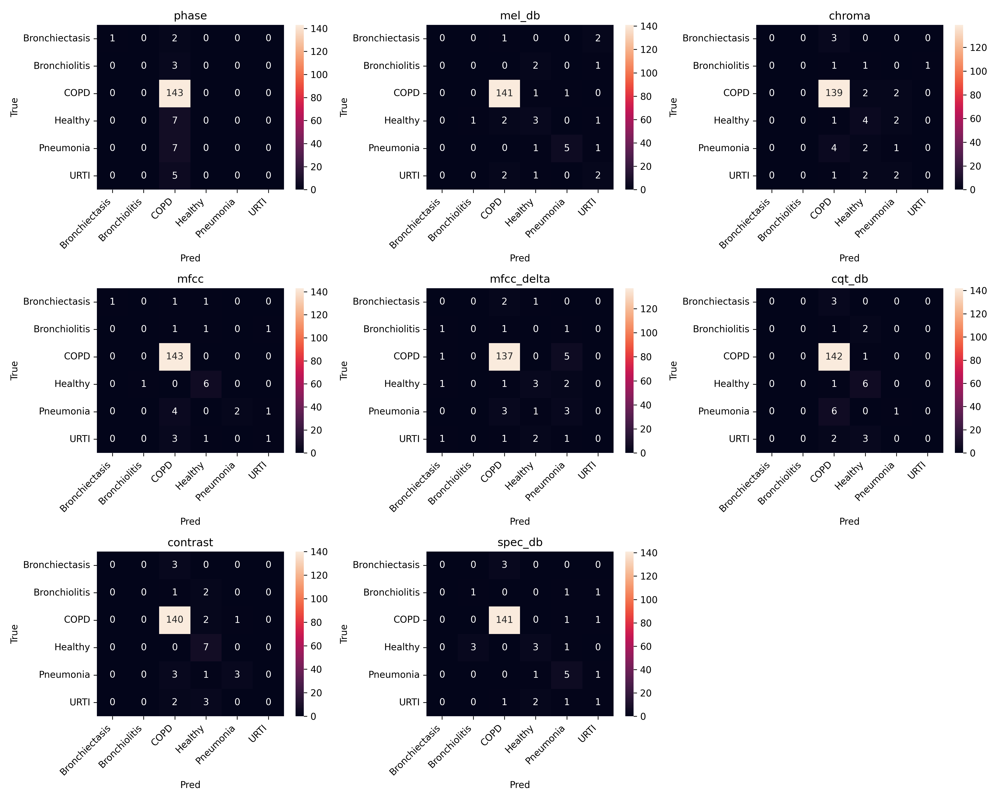
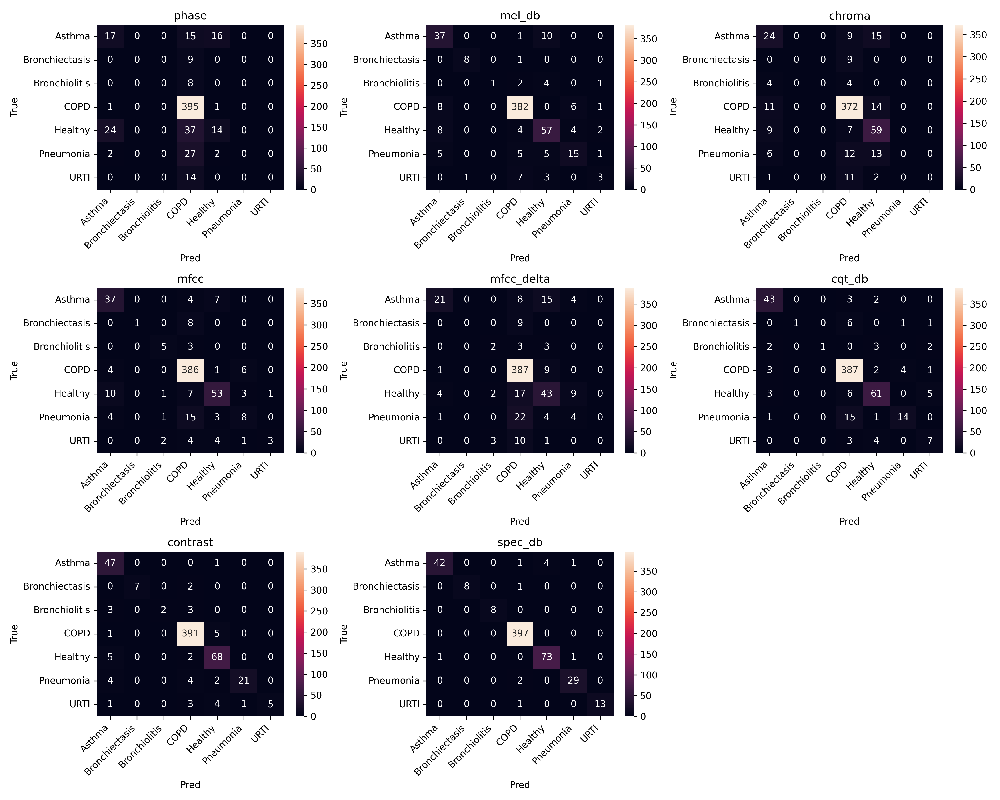

# `Classificação de Sons Pulmonares a partir de Espectrogramas`
# `Classification of Lung Sounds Using Spectrograms`

## Apresentação

O presente projeto foi originado no contexto das atividades da disciplina de pós-graduação *IA901 - Análise de Imagens e Reconhecimento de Padrões*, 
oferecida no primeiro semestre de 2026, na Unicamp, sob supervisão da Profa. Dra. Leticia Rittner, do Departamento de Engenharia de Computação e Automação (DCA) da Faculdade de Engenharia Elétrica e de Computação (FEEC). 

> Incluir nome RA e foco de especialização de cada membro do grupo. Os projetos devem ser desenvolvidos em duplas ou trios.

> | Nome                    | RA     | Curso                                 |
> |-------------------------|--------|---------------------------------------|
> | Rafael Ávila dos Santos | 300905 | Doutorado em Engenharia Elétrica     |
> | Letícia Lopes Mendes Da Silva  | 184423 | Graduação em Engenharia de Computação |
> | Sofia Ballerini de Vasconcellos  | 299904 | Doutorado em                          |

## Descrição do Projeto
> Descrição do objetivo principal do projeto, incluindo contexto gerador, motivação, etc. Qual problema você pretende solucionar? Qual a relevância do problema e o impacto da solução do mesmo?

O objetivo final do projeto é utilizar sons pulmonares para classificação de doenças respiratórias, como asma, pneumonia, etc. Para isso, serão utilizadas técnicas de processamento de imagens para converter os sinais áudios originais em espectrogramas, como, por exemplo, a transformada curta de Fourier (stft), com a intenção de manter as informações em relação ao tempo e à frequência.

## Metodologia
> Proposta de metodologia incluindo especificação de quais técnicas pretende-se explorar. Espera-se que nesta entrega você já seja capaz de descrever de maneira mais específica (do que na Entrega 1) quais as técnicas a serem empregadas em cada etapa do projeto.

- Inicialmente, o sinal de áudio foi transformado para o domínio tempo-frequência utilizando a Short-Time Fourier Transform (STFT). A partir dessa representação, diferentes transformadas foram extraídas, incluindo espectrograma em escala logarítmica, Mel spectrogram, coeficientes cepstrais Mel-frequency (MFCC), derivadas temporais dos MFCCs (delta coefficients), características cromáticas (Chroma), contraste espectral, Constant-Q Transform (CQT) e fase espectral. As equações destas transformações são apresentadas abaixo:

### Short-Time Fourier Transform (STFT)
A STFT divide o sinal em janelas curtas e calcula a Transformada de Fourier em cada uma.

A equação é:
$$
X(m,k)=\sum_{n=0}^{N-1} x[n+mH]\,w[n]\,e^{-j2\pi kn/N}
$$

Sendo:

- x[n]: sinal de áudio \
- w[n]: janela (geralmente Hann) \
- N: tamanho da FFT \
- H: hop length \
- m: índice temporal \
- k: bin de frequência

### Magnitude do Espectro
A magnitude representa a energia/amplitude de cada frequência ao longo do tempo. Ela é equacionada por:

$$
|X(m, k)| = \sqrt{\Re(X)^2 \quad \text{+} \quad \Im(X)^2}
$$

### Conversão para decibéis (Spectrogram dB)
A conversão para decibéis é util, tendo em vista que aproxima da percepção humana. Sua equação é dada por:

$$
S_{dB} = 20\log_{10}{(\frac{S}{S_{ref}})}
$$

Onde:

- S: magnitude espectral
- $S_{ref}$: referência (neste caso, o valor máximo).

### Mel Spectrogram
O resultado proveniente da transformada Mel Spectrogram se dá por duas etapas. Primeiro calcula-se o Espectrograma de Potência, conforme a equação:

$$
P(m, k) = |X(m, k)|^2
$$

Depois aplica-se um banco de filtros Mel:

$$
M(m,r)= \sum_k{H_r(k)P(m,k)}
$$

Onde:

- $H_r(k)$: filtro triangular Mel\
- r: índice do filtro Mel

Dessa forma, essa transformação comprime altas frequências para imitar a audição humana.

### Mel Frequency Cepstral Coefficients (MFCC)
Os MFCCs aplicam DCT no log-Mel spectrogram.

$$
L(m, r) = \log(M(m, r))
$$

Discrete Cosine Transform (DCT):
$$
C(m, n) = \sum_k^R{}L(m, r)\cos[\frac{\pi n}{R} (r + \frac{1}{2})]
$$

Onde:

- $C(m,n)$: coeficiente MFCC 
- R: número de filtros Mel

### Delta MFCC

$$
\Delta c_t= \frac{\sum_{n=1}^{N} n(c_{t+n}-c_{t-n})}{2\sum_{n=1}^{N} n^2}
$$

### Chroma

### Contrast

### Fase Espectral

## Bases de Dados e Evolução
> Elencar as bases de dados utilizadas no projeto.

Base de Dados | Endereço na Web | Resumo descritivo
----- | ----- | -----
ICBHI2017 | https://bhichallenge.med.auth.gr/ICBHI_2017_Challenge | Breve resumo (duas ou três linhas) sobre a base.
Fraiwan, et. al 2021 | https://data.mendeley.com/datasets/jwyy9np4gv/3 | Breve resumo (duas ou três linhas) sobre a base.

> Forneça também o link para o "datasheet" criado para os datasets (anexado na pasta `data`, como indicado nas [instruções E2](https://github.com/Disciplinas-FEEC/IA901-2026S1/blob/main/templates/ia901-E2-instructions.md)), contendo informações mais detalhadas e sistematizadas sobre as bases de dados.

## Ferramentas
> Ferramentas e/ou bibliotecas já utilizadas e/ou ainda a serem utilizadas (com base na visão atual do grupo sobre o projeto).

## Workflow
> Use uma ferramenta que permita desenhar o workflow e salvá-lo como uma imagem (Draw.io, por exemplo). Insira a imagem nesta seção.
> Você pode optar por usar um gerenciador de workflow (Sacred, Pachyderm, etc) e nesse caso use o gerenciador para gerar uma figura para você.
> Lembre-se que o objetivo de desenhar o workflow é ajudar a quem quiser reproduzir seus experimentos.
> Mais informações sobre o workflow podem ser encontradas nos materiais de apoio no Classroom (Reprodutibilidade em pesquisa computacional - workflow).

## Experimentos e Resultados preliminares
> Descreva de forma sucinta e organizada os experimentos realizados.
> Para cada experimento, apresente os principais resultados obtidos.
> Aponte os problemas encontrados nas soluções testadas até aqui.

> ### Análise Exploratória
- 

> ### Resultados Preliminares

Realizando as etapas descritas na Metodologia e no Workflow, obteu-se os resultados das métricas de avaliação para as 8 transformações analisadas, conforme apresentadas nas tabelas abaixo:

[Download results_ibchi.xlsx](results/results_icbhi.xlsx)

[Download results_mixed.xlsx](results/results_mixed.xlsx)

[Download results_6sec.xlsx](results/results_6sec.xlsx)

Como pode-se observar na figura abaixo, a quantidade de amostras para a validação da classe COPD é muito superior as demais. Como a divisão entre treino e validação foi feito na proporção 80%-20%, isso implica que durante o treinamento o modelo também lida com muito mais dados da classe COPD do que de quaisquer outra classe, o que pode tornar o modelo enviezado a aprender apenas ela. Essa afirmação se fortalece ao analisar as métricas de avaliação por classe. Embora na média global o modelo se encontre com acurária em torno de 80% para as 8 transformações avaliadas, ao analisar os valores por classe vemos uma diferença substancial, e que predomina com valores equivalente apenas para classe de maior quantidade de amostras.

Após adicionar mais amostras para as classes Asma, Pneumonia e saudável, a desigualdade amostral ainda continuou altamente presente. Com isso, o mesmo comportamente tendencioso para a classe COPD visto anteriormente se repete aqui, tanto ao analisar a matriz de confusão quanto observado nas métricas de avaliação por classe, dado a tabela.

Ao realizar o data-augmentation fazer o clip dos audios em 6 segundos ao invés de mantê-los em 20 como nos casos anteriores, observa-se alguns impactos significativos. Embora a desigualdade amostral permaneça, agora é possível observar que houve diferenças dos resultados entre as 8 transformações analizadas, ao invés de todas se manterem em torno de 80% de acurácia como nos casos anteriores.

Sendo assim, é possível resumir os resultados como:

- Os resultados preliminares são baseados nos resultados obtidos a partir do treinamento de uma rede baseada na InceptionV3 via Transfer Learning. Os primeiros resultados se dão utilizando como banco dados apenas as amostras do dataset nomeado ICBHI2017 e com as visualizações que partiram dos audios em 20 segundos. Posteriormente acrescentou-se amostras do dataset do Mohamad para as classes Healthy, Asthma e Pneumonia, ainda com os audios em 20 segundos. O terceiro grupo de resultados se deu utilizando agora o dataset composto pelos audios do ICBHI2017 e do Mohamad, porém, sob a visualização dos clips em 6 segundos, o que aumentou consideravelmente o número de amostras por classe. A classe LRTI como apresentou poucas amostras, foi desconsiderada para o treinamento.
- é possível observar a partir dos resultados obtidos para o caso 1 e o caso 2 que não houve discrepância significativa entre os resultados obtidos a partir das 8 transformações do sinal. Todavia, o resultado, que se apresenta em torno de 80% de acurácia em todos os casos, é enviezado pela alta quantidade de amostras da classe COPD. As outras métricas, principalmente analisadas individualmente por cada classe, reforçam isso.
- Destaca-se também a visualização "phase", onde esperava-se que ela não seria relevante e não conteria informações que fosse possível caracterizar e diferenciar as doenças pulmonares, mas em contrapartida o modelo de aprendizado de máquina foi capaz de utilizá-la e atingir resultados similares as demais análises.
- Por outro lado, os resultados obtidos a partir das visualizações com um conjunto maior de amostras começa-se a perceber variações dos resultados entre as formas de visualizações, demonstrando que algumas tem maior capacidade de caracterização das doenças do que outras.

## Próximos passos
> Nas etapas até aqui as transformações do sinal original de audio (MFCC,melspectrogram, etc) tem se mostrado eficazes para o uso posterior em aprendizado de máquina e classificação das doenças pulmonares. O principal gargalo encontrado até o momento é o desbalanceamento das amostras por classe, o que torna o classificador enviezado. Sendo assim, um dos nossos próximos passos é justamente buscar alternativas para lidar com esse problema. Para além, também buscaremos comparar os resultados utilizando outros algoritmos de aprendizado de máquina.

## Uso de IA Generativa
> Utilizou-se a IA para auxilio em comandos do markdown, bem como em ajustes de código.

## Referências
1. Rocha BM et al. (2019) "An open access database for the evaluation of respiratory sound classification algorithms" Physiological Measurement 40 035001
2. PARK, Jinho et al. Lung Sound Classification Model for On-Device AI. Applied Sciences, v. 15, n. 17, p. 9361, 2025.
3. MCFEE, Brian et al. librosa/librosa: 0.10. 0. zenodo, 2023.
4. 