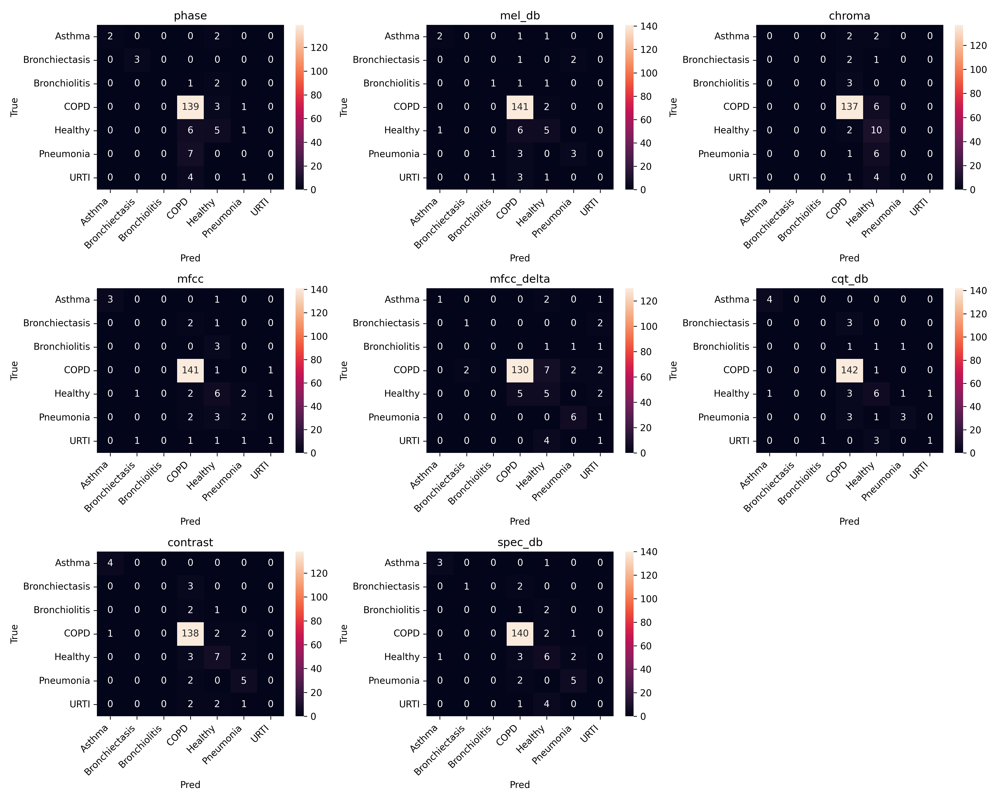

# Classificação de Sons Pulmonares a partir de Espectrogramas

## Apresentação

O presente projeto foi originado no contexto das atividades da disciplina de pós-graduação *IA901 - Análise de Imagens e Reconhecimento de Padrões*, oferecida no primeiro semestre de 2026, na Unicamp, sob supervisão da Profa. Dra. Leticia Rittner, do Departamento de Engenharia de Computação e Automação (DCA) da Faculdade de Engenharia Elétrica e de Computação (FEEC).

| Nome                    | RA     | Curso                                 |
|-------------------------|--------|---------------------------------------|
| Rafael Ávila dos Santos | 300905 | Doutorado em Engenharia Elétrica |
| Letícia Lopes Mendes Da Silva | 184423 | Graduação em Engenharia de Computação |
| Sofia Ballerini de Vasconcellos | 299904 | Doutorado em Engenharia Elétrica |

## Descrição do Projeto

O objetivo do projeto é utilizar sons pulmonares para classificação de doenças respiratórias, como asma, pneumonia, entre outras. Para isso, o sinal de áudio original é convertido em representações tempo-frequência (espectrogramas), como a Short-Time Fourier Transform (STFT), o Mel Spectrogram e os MFCCs, de forma a preservar simultaneamente as informações temporais e espectrais do sinal. Essas representações 2D são então utilizadas como entrada para redes neurais convolucionais (CNNs) pré-treinadas, treinadas via Transfer Learning para realizar a classificação multiclasse das patologias respiratórias. O projeto cobre, portanto, desde a obtenção e o pré-processamento dos dados brutos de áudio até o treinamento e avaliação dos classificadores.

## Bases de Dados

Os datasets públicos utilizados no projeto consistem em gravações de sons respiratórios obtidas em contexto clínico, acompanhadas de anotações e metadados associados. As bases foram escolhidas devido ao amplo uso em pesquisas de classificação automática de doenças pulmonares.

| Base de Dados | Endereço na Web | Resumo descritivo |
|-----|-----|-----|
| ICBHI Challenge (2017) | https://bhichallenge.med.auth.gr/ICBHI_2017_Challenge | Dataset utilizado no ICBHI 2017 Respiratory Sound Challenge. Contém gravações respiratórias de pacientes, anotadas com 8 doenças pulmonares, além de anotações de ciclos respiratórios, sibilos e estalos realizadas por especialistas. Contém 920 amostras de 126 pacientes. |
| KAUH (2021) Respiratory Sound Dataset | https://data.mendeley.com/datasets/jwyy9np4gv/3 | Base composta por gravações respiratórias obtidas com estetoscópio digital e disponibilizadas em diferentes modos de filtragem acústica, anotadas com 11 doenças cardiopulmonares. Contém 336 amostras de 112 pacientes. |

Os áudios de ambas as bases estão disponíveis no formato `.wav`. As anotações, no entanto, são fornecidas em formatos distintos:

- **ICBHI 2017**: as anotações estão em arquivos de texto (`.txt`), sendo um deles responsável por relacionar o identificador de cada paciente ao respectivo diagnóstico (`ICBHI_Challenge_diagnosis.txt`), outro contendo informações demográficas (`ICBHI_Challenge_demographic_information.txt`), e um terceiro definindo a divisão oficial entre treino e teste proposta pelo desafio (`ICBHI_challenge_train_test.txt`).
- **KAUH (2021)**: as anotações estão concentradas em uma planilha Excel, contendo dados do paciente, informações sobre a aquisição do exame (modo de filtragem do estetoscópio, por exemplo) e o diagnóstico associado, quando houver.

Em ambos os casos, os dados não estão originalmente balanceados entre as classes: a classe COPD (Doença Pulmonar Obstrutiva Crônica) concentra a maior parte das amostras, enquanto patologias como Asma e Bronquiectasia possuem poucas amostras disponíveis. Esse desbalanceamento é um dos principais desafios do projeto e é tratado em diferentes etapas do pipeline, descritas na seção de Metodologia.

Datasheet: [Datasheet (PDF)](data/datasheet.pdf)

## Metodologia

### Visão Geral do Pipeline

O pipeline implementado está organizado em seis etapas sequenciais, cada uma correspondendo a um notebook do repositório:

1. **Coleta dos dados** (`1_data_loading.ipynb`): download e organização dos datasets ICBHI 2017 e KAUH (2021) em uma estrutura de pastas padronizada.
2. **Análise exploratória dos sinais de áudio** (`2_audio_analysis.ipynb`): verificação da integridade dos arquivos, distribuição das classes, dados demográficos e duração das gravações.
3. **Análise das transformações tempo-frequência** (`3_transforms_analysis.ipynb`): exploração visual e comparativa das diferentes representações 2D candidatas a serem extraídas dos áudios.
4. **Pré-processamento do sinal de áudio** (`4_preprocess_audio.ipynb`): padronização da taxa de amostragem, segmentação em janelas e normalização do sinal 1D.
5. **Extração das características tempo-frequência** (`5_preprocess_features.ipynb`): geração das representações 2D (espectrogramas) que alimentam as CNNs.
6. **Treinamento e avaliação dos classificadores** (`6_training_resnet50.ipynb`, `6_training_inception_v3.ipynb`, `6_training_densenet121.ipynb`): treinamento via Transfer Learning e avaliação quantitativa dos modelos.

### Pré-processamento do Sinal de Áudio (1D)

Conforme identificado na análise exploratória, as gravações originais apresentam durações bastante heterogêneas (entre 7,86s e 86,20s, com média de 21,49s), além de forte desbalanceamento entre classes. A primeira abordagem testada para padronizar as durações consistiu em preencher os áudios mais curtos com zeros e truncar os mais longos, fixando todas as amostras em 20 segundos. Essa estratégia, entretanto, introduz um artefato: para os áudios mais curtos, surge uma região "vazia" no espectrograma resultante, que não carrega informação sobre a patologia, mas sim sobre o próprio pré-processamento.

Para contornar essa limitação, o pipeline atual substitui o zero-padding por uma estratégia de janelamento com sobreposição (*windowing*), aplicada da seguinte forma:

- **Reamostragem**: todos os sinais são reamostrados para uma taxa de amostragem comum de 22.050 Hz.
- **Janelamento**: cada gravação é dividida em janelas de 5 segundos. Para a maioria das classes, utiliza-se um *hop* de 2,5 segundos (50% de sobreposição), o que também funciona como uma forma de data augmentation, aumentando a quantidade de amostras disponíveis para as classes minoritárias. Para a classe COPD — que já é amplamente majoritária no conjunto de dados — utiliza-se um *hop* de 5 segundos (sem sobreposição), de forma a evitar a geração de janelas redundantes e, assim, reduzir o desbalanceamento entre classes.
- **Normalização**: cada janela de áudio é normalizada pela sua amplitude máxima.

Essa abordagem elimina o artefato de padding observado anteriormente e atua simultaneamente como mecanismo de data augmentation (para classes minoritárias) e de subamostragem (para a classe COPD).

### Extração de Características Tempo-Frequência (2D)

A partir do sinal 1D pré-processado, diferentes representações tempo-frequência são extraídas utilizando a biblioteca `Librosa`. Todas partem da Short-Time Fourier Transform (STFT), que divide o sinal em janelas curtas e calcula a Transformada de Fourier em cada uma:

$$X(m,k)=\sum_{n=0}^{N-1} x[n+mH]\,w[n]\,e^{-j2\pi kn/N}$$

Sendo:

- x[n]: sinal de áudio
- w[n]: janela (geralmente Hann)
- N: tamanho da FFT
- H: hop length
- m: índice temporal
- k: bin de frequência

A partir do coeficiente complexo $X(m,k)$, são derivadas as oito representações efetivamente extraídas e utilizadas no treinamento dos classificadores (implementadas em `5_preprocess_features.ipynb`):

**Parte Real e Parte Imaginária da STFT (RealSTFT / ImagSTFT)**

$$\text{RealSTFT}(m,k) = \Re(X(m,k)) \qquad \text{ImagSTFT}(m,k) = \Im(X(m,k))$$

**Magnitude do Espectro (MagSTFT)**

A magnitude representa a energia/amplitude de cada frequência ao longo do tempo:

$$|X(m, k)| = \sqrt{\Re(X)^2 + \Im(X)^2}$$

**Fase Espectral (Phase)**

$$\phi(m, k) = \tan^{-1}\left(\frac{\Im(X(m, k))}{\Re(X(m, k))}\right)$$

**Mel Spectrogram**

Calculada em duas etapas. Primeiro o espectrograma de potência:

$$P(m, k) = |X(m, k)|^2$$

Depois aplica-se um banco de filtros Mel:

$$M(m,r)= \sum_k{H_r(k)P(m,k)}$$

Onde $H_r(k)$ é o filtro triangular Mel e r é o índice do filtro. Essa transformação comprime altas frequências para imitar a audição humana.

**Mel Frequency Cepstral Coefficients (MFCC)**

Aplica-se a Discrete Cosine Transform (DCT) sobre o log-Mel spectrogram:

$$L(m, r) = \log(M(m, r))$$

$$C(m, n) = \sum_k^R{}L(m, r)\cos\left[\frac{\pi n}{R} \left(r + \frac{1}{2}\right)\right]$$

Onde $C(m,n)$ é o coeficiente MFCC e R o número de filtros Mel.

**Delta MFCC (MFCCDelta)**

Derivada temporal dos coeficientes MFCC:

$$\Delta c_t= \frac{\sum_{n=1}^{N} n(c_{t+n}-c_{t-n})}{2\sum_{n=1}^{N} n^2}$$

**Chroma**

$$Chroma(p, t) = \sum_{k \in K_{p}}{|X(t, k)|}$$

Onde p é a classe cromática (C, C#, D, ...) e $K_p$ são os bins associados àquela nota.

> Durante a etapa de análise exploratória das transformações (`3_transforms_analysis.ipynb`), outras representações também foram investigadas, como o Spectral Contrast e a Constant-Q Transform (CQT). Entretanto, o conjunto final de oito representações utilizado para a extração de features e o treinamento dos modelos é o listado acima.

**Combinações de canais (stacks)**

Além das oito representações individuais, também foram testadas combinações de 2 a 3 representações empilhadas em um único tensor multicanal, de forma análoga aos canais RGB de uma imagem natural. Os experimentos incluem as combinações: ImagSTFT + RealSTFT (2 canais), MagSTFT + Phase (2 canais), e MelSpectrogram + MFCC + Chroma (3 canais).

### Modelos de Classificação e Treinamento

A classificação é realizada via Transfer Learning, utilizando três arquiteturas de CNN consagradas para classificação de imagens: **ResNet50**, **InceptionV3** e **DenseNet121**. O pipeline de treinamento foi implementado em PyTorch, com PyTorch Lightning estruturando o laço de treinamento (módulos `LungSoundDataModule` e `LungSoundClassifier`).

Para cada arquitetura, o mesmo protocolo experimental é repetido para cada uma das oito representações tempo-frequência e para as combinações de canais descritas acima, permitindo comparar qual representação é mais informativa para a tarefa. Os principais hiperparâmetros utilizados são:

| Hiperparâmetro | Valor |
|---|---|
| Arquiteturas testadas | ResNet50, InceptionV3, DenseNet121 |
| Pesos pré-treinados | Sem pré-treino e com pesos ImageNet (`IMAGENET1K_V1`), comparados entre si |
| Otimizador | AdamW |
| Taxa de aprendizado | 1e-4 |
| Weight decay | 1e-5 |
| Scheduler | StepLR (step_size=7, gamma=0.1) |
| Função de perda | CrossEntropyLoss |
| Batch size | 32 |
| Precisão de treinamento | Mixed precision (16-bit) |
| Épocas máximas | 100, com early stopping (paciência de 10 épocas, monitorando `val_f1_macro`) |
| Estratégia de amostragem | Sampler "equalizer" para balanceamento entre classes durante o treinamento, com limite de 1000 amostras por classe |
| Divisão dos dados | Holdout em treino/validação/teste |
| Semente aleatória | 42, para garantir reprodutibilidade |
| Checkpoint do modelo | Melhor checkpoint salvo conforme `val_f1_macro` (modo max) |

O acompanhamento dos experimentos (curvas de perda, acurácia e demais métricas ao longo do treinamento) é feito via TensorBoard.

### Métricas de Avaliação

Como métricas de avaliação são utilizadas as métricas clássicas de classificação: acurácia, precision, recall e F1-Score, calculadas tanto de forma global quanto individualmente por classe. Para cada experimento (combinação de arquitetura + representação tempo-frequência), são gerados o relatório de classificação (`classification_report`), curvas ROC e Precision-Recall por classe (estratégia one-vs-rest) e a matriz de confusão. Os resultados de cada experimento — incluindo rótulos verdadeiros, predições e probabilidades por classe — são salvos em arquivo CSV para análise posterior.

## Ferramentas

Este projeto foi desenvolvido principalmente em Python, com a maior parte da exploração e dos experimentos documentados em notebooks.

- **Bibliotecas utilizadas:**
	- **NumPy:** operações numéricas e arrays.
	- **Librosa:** carregamento de áudio, transformações para o espaço 2D (STFT, Mel-spectrogram, MFCCs, etc.) e utilitários de áudio.
	- **SoundFile:** leitura e escrita dos arquivos de áudio pré-processados.
	- **Matplotlib / Seaborn:** visualização de espectrogramas, distribuições e gráficos.
	- **Pandas:** manipulação de tabelas, metadados e resultados.
	- **scikit-learn:** split de conjuntos, métricas e utilitários de avaliação.
	- **TensorFlow / Keras:** utilizado nos experimentos iniciais de treinamento de modelos de classificação (resultados preliminares).
	- **PyTorch / PyTorch Lightning:** utilizado no pipeline atual de treinamento, estruturando os módulos de dados (`DataModule`) e de modelo (`LightningModule`), bem como callbacks de checkpoint e early stopping.
	- **torchinfo:** sumarização da arquitetura e do número de parâmetros dos modelos.
	- **TensorBoard:** monitoramento dos experimentos, permitindo acompanhar métricas como perda, acurácia e curvas de treinamento entre diferentes execuções.

## Workflow

> O diagrama de workflow ainda reflete a primeira versão do pipeline (geração de imagens via `librosa.display.specshow` e treinamento em TensorFlow/Keras). Está nos próximos passos atualizá-lo para refletir o pipeline atual, descrito na seção de Metodologia.

## Experimentos e Resultados Preliminares

### Análise Exploratória

- Esta etapa do projeto consistiu na realização de uma análise exploratória da distribuição das durações dos sinais de áudio respiratório.
O script percorre todas as pastas correspondentes às doenças respiratórias no dataset, identifica os arquivos .wav e calcula a duração de cada gravação utilizando a biblioteca Librosa. As durações e respectivas classes são armazenadas para posterior análise estatística. Foram analisadas 920 amostras de áudio:

| Métrica | Valor |
|---|---|
| Duração mínima | 7,86 s |
| Duração máxima | 86,20 s |
| Duração média | 21,49 s |

O histograma a seguir ilusta distribuição das durações dos sinais de áudio, evidenciando uma concentração de amostras com duração de 20 segundos. No entanto, observa-se a existência de gravações com durações discrepantes, alcançando valores significativamente inferiores e superiores à média do conjunto de dados. Essa heterogeneidade temporal pode dificultar o processo de treinamento dos modelos de aprendizado profundo, devido à inconsistência no comprimento das entradas.

Adicionalmente, foram feitas análises individuais para cada classe do dataset, permitindo uma análise mais detalhada da distribuição das durações entre as diferentes patologias respiratórias. Para a classe Asthma (Asma), observa-se apenas uma amostra, com duração concentrada em aproximadamente 20 segundos. De forma semelhante, as classes Bronchiectasis (Bronquiectasia) e Bronchiolitis (Bronquiolite) apresentam, respectivamente, 16 e 13 amostras, todas concentradas na mesma duração.
A classe COPD (Doença Pulmonar Obstrutiva Crônica) apresenta um comportamento significativamente diferente das demais, contendo mais de 700 amostras. Apesar de existir uma variação nas durações, aproximadamente entre 10 e 30 segundos, nota-se uma predominância expressiva de sinais próximos de 20 segundos, representando a maior parte das amostras dessa classe.
Para a classe Healthy (Saudável), observa-se aproximadamente 30 amostras, também concentradas próximas de 20 segundos, com pequenas variações temporais inferiores a 0,2 segundos. Já a classe LRTI (Infecção do Trato Respiratório Superior) apresenta apenas duas amostras, ambas próximas de 20 segundos.
Na classe Pneumonia, observa-se cerca de 40 amostras concentradas em torno de 20 segundos de duração. Por fim, a classe URTI (Infecção do Trato Respiratório Inferior) apresenta aproximadamente 25 amostras próximas de 20 segundos, além de uma amostra com pequeno desvio temporal, em torno de 19,85 segundos.
A partir dessa análise, é possível observar não apenas diferenças nas durações dos sinais entre algumas amostras, mas principalmente um forte desbalanceamento entre as classes do conjunto de dados, que motivou a estratégia de janelamento descrita na seção de Metodologia.

Entre as representações extraídas, o **Mel Spectrogram** foi utilizado para visualização qualitativa dos padrões espectrais presentes nos sinais respiratórios.

A análise do Mel Spectrogram evidencia diferenças entre os padrões respiratórios das patologias e o sinal considerado saudável. No caso do sinal Healthy (Saudável), observa-se uma distribuição espectral homogênea e contínua, com predominância de energia concentrada nas baixas frequências, comportamento esperado em ciclos respiratórios fisiológicos. Há menor presença de eventos impulsivos e menor variabilidade temporal, indicando estabilidade do fluxo aéreo pulmonar. Já nos sinais patológicos, percebe-se aumento da complexidade espectral e mudanças importantes na distribuição temporal da energia:

-Asthma apresenta regiões intermitentes de energia distribuídas em faixas específicas de frequência, compatíveis com a presença de sibilos.

-Bronchiectasis mostra um padrão bastante energético e repetitivo ao longo do tempo, com estruturas verticais recorrentes e ampla ocupação espectral.

-Bronchiolitis apresenta distribuição espectral mais difusa, com maior densidade de componentes em médias frequências.

-LRTI exibe eventos esparsos de energia intensa, indicando comportamento acústico menos regular que o saudável.

-Pneumonia apresenta regiões isoladas de alta intensidade espectral, além de maior espalhamento energético em frequências médias e baixas.

-URTI mostra aumento moderado da atividade espectral e maior irregularidade temporal em comparação ao saudável, embora com menor complexidade que patologias pulmonais mais severas.

No caso do COPD, observa-se um comportamento diferente dos demais. Parte do espectrograma contém atividade espectral normal do sinal respiratório, enquanto uma grande região escura aparece no restante da imagem. Isso ocorre devido ao zero padding aplicado durante o pré-processamento inicial para padronizar todos os áudios em 20 segundos — artefato que motivou a substituição dessa abordagem pela estratégia de janelamento sem padding, descrita na seção de Metodologia. Mesmo assim, na região correspondente ao áudio real, o COPD ainda apresenta um padrão mais irregular e fragmentado em comparação ao saudável, o que está de acordo com alterações respiratórias típicas da doença.

### Resultados Preliminares

Os resultados a seguir são preliminares e foram obtidos com a primeira versão do pipeline (treinamento de uma rede baseada na InceptionV3 via Transfer Learning, com TensorFlow/Keras, sobre espectrogramas renderizados como imagens PNG e áudios padronizados em 20 segundos via zero-padding). Eles antecedem e motivaram a redefinição do pipeline atual, descrita na seção de Metodologia, cujos resultados consolidados (comparando ResNet50, InceptionV3 e DenseNet121 sobre as oito representações tempo-frequência e suas combinações) serão incluídos em uma atualização futura deste documento.

Realizando as etapas descritas, obteu-se os resultados das métricas de avaliação para as 8 transformações analisadas, conforme apresentadas nas tabelas abaixo (Para Download, as Tabelas completas e em gráfico exemplos das tabelas parciais):

| feature    | class          |   precision |   recall |   f1_score |   support |   accuracy_global |   precision_global |   recall_global |   f1_global |
|:-----------|:---------------|------------:|---------:|-----------:|----------:|------------------:|-------------------:|----------------:|------------:|
| phase      | Bronchiectasis |    1        | 0.333333 |   0.5      |         3 |          0.857143 |           0.746721 |        0.857143 |    0.79422  |
| phase      | Bronchiolitis  |    0        | 0        |   0        |         3 |          0.857143 |           0.746721 |        0.857143 |    0.79422  |
| phase      | COPD           |    0.856287 | 1        |   0.922581 |       143 |          0.857143 |           0.746721 |        0.857143 |    0.79422  |
| phase      | Healthy        |    0        | 0        |   0        |         7 |          0.857143 |           0.746721 |        0.857143 |    0.79422  |
| phase      | Pneumonia      |    0        | 0        |   0        |         7 |          0.857143 |           0.746721 |        0.857143 |    0.79422  |
| phase      | URTI           |    0        | 0        |   0        |         5 |          0.857143 |           0.746721 |        0.857143 |    0.79422  |

[Download results_ibchi.xlsx](assets/preliminary_results/results_icbhi.xlsx)

| feature            | class          | precision | recall | f1_score | support | accuracy_global | precision_global | recall_global | f1_global |
| ------------------ | -------------- | --------- | ------ | -------- | ------- | --------------- | ---------------- | ------------- | --------- |
| phase              | Asthma         | 1.0000    | 0.5000 | 0.6667   | 4       | 0.8418          | 0.7831           | 0.8418        | 0.8089    |
| phase              | Bronchiectasis | 1.0000    | 1.0000 | 1.0000   | 3       | 0.8418          | 0.7831           | 0.8418        | 0.8089    |
| phase              | Bronchiolitis  | 0.0000    | 0.0000 | 0.0000   | 3       | 0.8418          | 0.7831           | 0.8418        | 0.8089    |
| phase              | COPD           | 0.8854    | 0.9720 | 0.9267   | 143     | 0.8418          | 0.7831           | 0.8418        | 0.8089    |
| phase              | Healthy        | 0.4167    | 0.4167 | 0.4167   | 12      | 0.8418          | 0.7831           | 0.8418        | 0.8089    |
| phase              | Pneumonia      | 0.0000    | 0.0000 | 0.0000   | 7       | 0.8418          | 0.7831           | 0.8418        | 0.8089    |
| phase              | URTI           | 0.0000    | 0.0000 | 0.0000   | 5       | 0.8418          | 0.7831           | 0.8418        | 0.8089    |

[Download results_mixed.xlsx](assets/preliminary_results/results_mixed.xlsx)

| feature     | class          | precision | recall | f1_score | support | accuracy_global | precision_global | recall_global | f1_global |
| ----------- | -------------- | --------- | ------ | -------- | ------- | --------------- | ---------------- | ------------- | --------- |
| phase       | Asthma         | 0.3864    | 0.3542 | 0.3696   | 48      | 0.7320          | 0.6201           | 0.7320        | 0.6613    |
| phase       | Bronchiectasis | 0.0000    | 0.0000 | 0.0000   | 9       | 0.7320          | 0.6201           | 0.7320        | 0.6613    |
| phase       | Bronchiolitis  | 0.0000    | 0.0000 | 0.0000   | 8       | 0.7320          | 0.6201           | 0.7320        | 0.6613    |
| phase       | COPD           | 0.7822    | 0.9950 | 0.8758   | 397     | 0.7320          | 0.6201           | 0.7320        | 0.6613    |
| phase       | Healthy        | 0.4242    | 0.1867 | 0.2593   | 75      | 0.7320          | 0.6201           | 0.7320        | 0.6613    |
| phase       | Pneumonia      | 0.0000    | 0.0000 | 0.0000   | 16      | 0.7320          | 0.6201           | 0.7320        | 0.6613    |
| phase       | URTI           | 0.0000    | 0.0000 | 0.0000   | 22      | 0.7320          | 0.6201           | 0.7320        | 0.6613    |

[Download results_6sec.xlsx](assets/preliminary_results/results_6sec.xlsx)

Como pode-se observar na figura abaixo, a quantidade de amostras para a validação da classe COPD é muito superior as demais. Como a divisão entre treino e validação foi feito na proporção 80%-20%, isso implica que durante o treinamento o modelo também lida com muito mais dados da classe COPD do que de quaisquer outra classe, o que pode tornar o modelo enviesado a aprender apenas ela. Essa afirmação se fortalece ao analisar as métricas de avaliação por classe, conforme disposto nas Tabelas. Embora na média global o modelo se encontre com acurária em torno de 80% para as 8 transformações avaliadas, ao analisar os valores por classe vemos uma diferença substancial, e que predomina com valores equivalente apenas para classe de maior quantidade de amostras.

Após adicionar mais amostras para as classes Asma, Pneumonia e saudável, a desigualdade amostral ainda continuou altamente presente. Com isso, o mesmo comportamente tendencioso para a classe COPD visto anteriormente se repete aqui, tanto ao analisar a matriz de confusão quanto observado nas métricas de avaliação por classe, dado a tabela.

Ao realizar o data-augmentation fazendo o clip dos audios em 6 segundos ao invés de mantê-los em 20 segundos como nos casos anteriores, observa-se alguns impactos significativos. Embora a desigualdade amostral permaneça, agora é possível observar que houve diferenças dos resultados entre as 8 transformações analisadas, ao invés de todas se manterem em torno de 80% de acurácia como nos casos anteriores.

Sendo assim, é possível resumir os resultados como:

- Os resultados preliminares são baseados nos resultados obtidos a partir do treinamento de uma rede baseada na InceptionV3 via Transfer Learning. Os primeiros resultados dão-se utilizando como banco dados apenas as amostras do dataset nomeado ICBHI2017 e com as visualizações que partiram dos audios em 20 segundos. Posteriormente acrescentou-se amostras do dataset KAUH para as classes Saudável, Asma e Pneumonia, ainda com os audios em 20 segundos. O terceiro grupo de resultados deu-se utilizando agora o dataset composto pelos audios do ICBHI2017 e do KAUH, porém, sob a visualização dos clips em 6 segundos, o que aumentou consideravelmente o número de amostras por classe. A classe LRTI como apresentou poucas amostras, foi desconsiderada para o treinamento.
- É possível observar a partir dos resultados obtidos para o caso 1 e o caso 2 que não houve discrepância significativa entre os resultados obtidos a partir das 8 transformações do sinal de audio. Todavia, o resultado, que se apresenta em torno de 80% de acurácia em todos os casos, é enviesado pela alta quantidade de amostras da classe COPD. As outras métricas, principalmente analisadas individualmente por cada classe, reforçam isso.
- Destaca-se também a visualização "phase", onde se esperava que ela não seria relevante e não conteria informações que fosse possível caracterizar e diferenciar as doenças pulmonares, em contrapartida, o modelo de aprendizado de máquina foi capaz de utilizá-la e atingir resultados similares as demais análises.
- Por outro lado, os resultados obtidos a partir das visualizações com um conjunto maior de amostras começa-se a perceber variações dos resultados entre as formas de visualizações, demonstrando que algumas têm maior capacidade de caracterização das doenças do que outras.

## Uso de IA Generativa

Utilizou-se IA generativa como apoio em comandos de markdown, ajustes de código e na reorganização e complementação da documentação deste README, a partir do conteúdo já presente nos notebooks do projeto.

## Referências

1. FRAIWAN, Mohammad; FRAIWAN, Luay; KHASSAWNEH, Basheer; IBNIAN, Ali.
   *A dataset of lung sounds recorded from the chest wall using an electronic stethoscope*.
   Data in Brief, v. 35, p. 106913, 2021.
   DOI: https://doi.org/10.1016/j.dib.2021.106913

2. ROCHA, Bruno M. et al.
   *An open access database for the evaluation of respiratory sound classification algorithms*.
   Physiological Measurement, v. 40, n. 3, p. 035001, 2019.
   DOI: https://doi.org/10.1088/1361-6579/ab03ea

3. WANASINGHE, Thinira; BANDARA, Sakuni; MADUSANKA, Supun; MEEDENIYA, Dulani Apeksha; BANDARA, Meelan; DE LA TORRE DÍEZ, Isabel.
   *Lung Sound Classification With Multi-Feature Integration Utilizing Lightweight CNN Model*.
   IEEE Access, v. 12, p. 21262–21276, 2024.

4. PARK, Jinho et al.
   *Lung Sound Classification Model for On-Device AI*.
   Applied Sciences, v. 15, n. 17, p. 9361, 2025.

5. MCFEE, Brian et al. librosa/librosa: 0.10. 0. zenodo, 2023.
